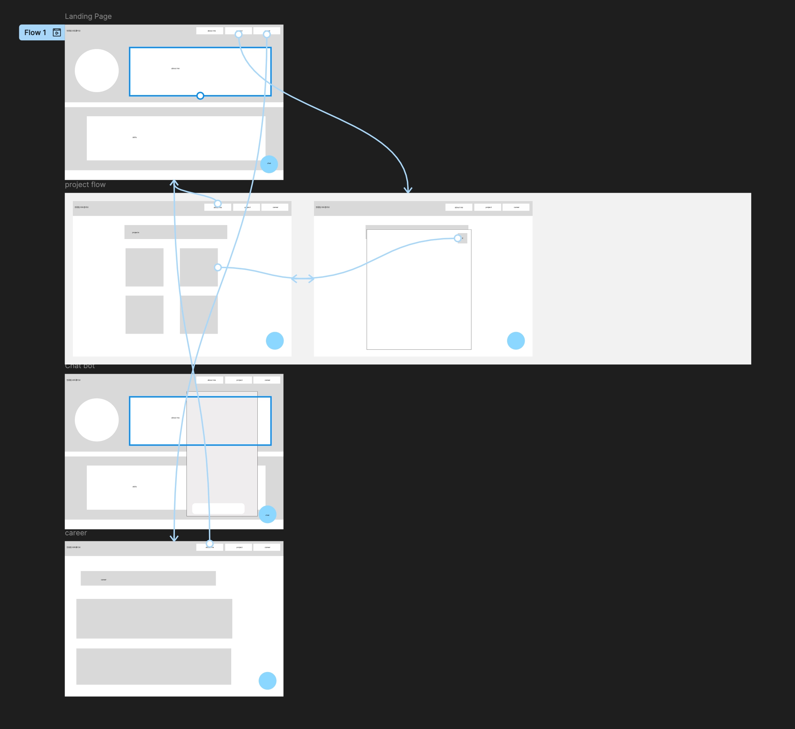

# Jongpil Portfolio

React와 TypeScript로 구현한 개인 포트폴리오 웹사이트입니다.

자기소개, 경력, 프로젝트 경험, 기술 스택을 한눈에 확인할 수 있도록 구성했으며, **Gemini API와 GitHub Repository 조회 API를 활용한 프로젝트 설명 챗봇**을 함께 제공합니다.

---

## Links

* **Portfolio**: [Vercel 배포 주소](https://autoever-1st-project-seven.vercel.app/)
* **GitHub**: https://github.com/jongpil1/autoever-1st-project

---

## Preview

### About me 


### AI Project Chatbot


### Career


---

## 프로젝트 소개

개인 포트폴리오를 웹사이트 형태로 제작하여 자기소개, 경력, 프로젝트 및 기술 스택을 효과적으로 보여줄 수 있도록 구현했습니다.

단순히 프로젝트 정보를 보여주는 것에서 그치지 않고, **GitHub Repository의 정보를 API로 조회하고 Gemini API와 연동하여 프로젝트에 대해 질문할 수 있는 AI 챗봇**을 구현했습니다.

이를 통해 사용자가 프로젝트의 기술 스택이나 구현 내용에 대해 직접 질문하고 답변을 받을 수 있도록 구성했습니다.

---

## 주요 기능

* About Me 페이지
* Projects 페이지
* Career 페이지
* 프로젝트 카드 및 상세 정보 모달
* 프로젝트 README 내용을 기반으로 한 설명 보기
* GitHub Repository 정보 조회 API
* Gemini API 기반 프로젝트 설명 챗봇
* Supabase를 활용한 프로젝트 데이터 연결
* React Router 기반 페이지 라우팅
* 반응형 웹 UI

---

## 기술 스택

### Frontend

* React
* TypeScript
* Vite
* React Router
* TanStack Query
* CSS Modules

### Backend / API

* GitHub API
* Gemini API
* Supabase

---

## 프로젝트 구조

```txt
src/

  app/
    App.tsx
    App.module.css

  entities/
    gemini/
    post/

  pages/
    aboutme/
    career/
    projects/

  shared/
    api/

  widgets/
    ProjectChat.tsx

public/

  posts/
    ...markdown files
```

---

## 핵심 기능

### 1. 포트폴리오 페이지

자기소개, 기술 스택, 경력 정보를 각각의 페이지로 분리하여 구성했습니다.

React Router를 활용하여 About Me, Projects, Career 화면을 Route 기반으로 전환할 수 있도록 구현했습니다.

---

### 2. 프로젝트 카드 및 README

각 프로젝트를 카드 형태로 구성하여 프로젝트의 핵심 정보를 한눈에 확인할 수 있도록 구현했습니다.

프로젝트의 상세 정보를 확인할 수 있으며, **Markdown으로 작성한 README 파일을 모달 형태로 표시**하여 별도의 페이지 이동 없이 프로젝트 설명을 확인할 수 있도록 구성했습니다.

---

### 3. GitHub Repository 조회 API

AI 챗봇이 프로젝트에 대한 질문에 답변할 수 있도록 **GitHub Repository 정보를 API를 통해 조회하는 기능**을 구현했습니다.

Repository의 프로젝트 정보와 GitHub 데이터를 가져와 AI가 프로젝트의 실제 구현 내용을 참고할 수 있도록 구성했습니다.

이를 통해 단순히 미리 작성된 프로젝트 설명을 제공하는 것이 아니라, **실제 GitHub Repository를 기반으로 프로젝트를 설명할 수 있도록 구현**했습니다.

---

### 4. Gemini 기반 AI 프로젝트 설명 챗봇

Gemini API를 활용하여 프로젝트에 대해 질문할 수 있는 AI 챗봇을 구현했습니다.

사용자가 프로젝트의 기술 스택, 주요 기능, 구현 방식 등에 대해 질문하면 프로젝트 README와 GitHub Repository 정보를 기반으로 답변을 제공합니다.

```txt
사용자 질문
    ↓
Project Chatbot
    ↓
GitHub Repository 조회
    ↓
프로젝트 데이터 / README
    ↓
Gemini API
    ↓
AI 응답
```

이를 통해 포트폴리오 방문자가 프로젝트 정보를 직접 탐색하지 않아도 **대화형으로 프로젝트를 이해할 수 있도록** 구현했습니다.

---

### 5. Supabase 데이터 연결

프로젝트 관련 데이터를 Supabase와 연결하여 관리했습니다.

React 애플리케이션에서는 TanStack Query를 활용하여 서버 데이터를 조회하고 캐싱하도록 구성했습니다.

---

## Design

프로젝트의 UI 및 페이지 구조는 Figma를 활용하여 설계했습니다.

### Figma



### 화면 구성

```txt
Portfolio
│
├── About Me
│   ├── Profile
│   ├── Skills
│   └── Introduction
│
├── Projects
│   ├── Project Cards
│   └── README Modal
│
├── Career
│   └── Career / Education
│
└── AI Project Chatbot
```

---

## Deployment

Vercel을 활용하여 포트폴리오 웹사이트를 배포했습니다.

**Portfolio**

https://autoever-1st-project-seven.vercel.app/

---


## Contact

* GitHub: https://github.com/jongpil1
* Email: [paulgks1@naver.com](mailto:paulgks1@naver.com)


